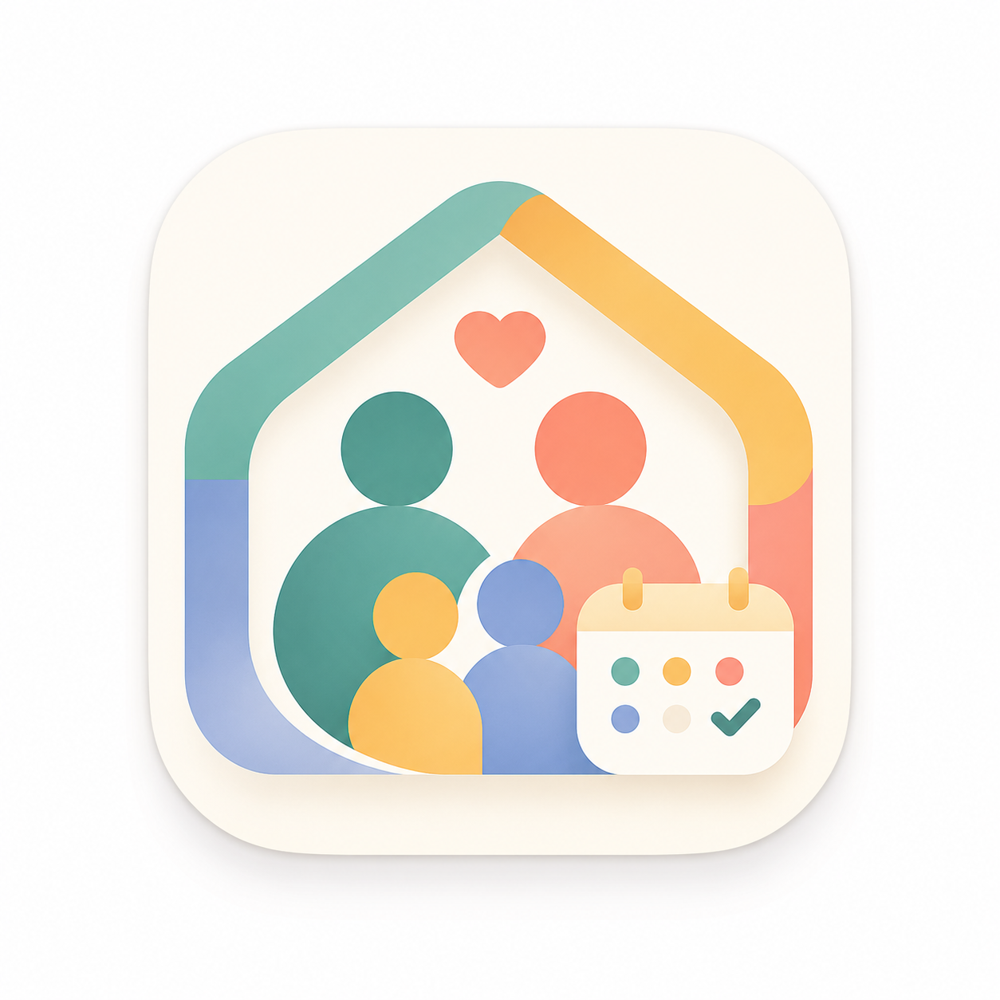

<div align="center">



# Family Organizer

**Gestión familiar de código abierto y autoalojada — calendario familiar compartido, tareas, lecciones, mensajes y finanzas, sincronizados en tiempo real**

**Una alternativa a Cozi, autoalojada y centrada en la privacidad**

[](./LICENSE)
[](https://nextjs.org)
[](https://expo.dev)
[](https://instantdb.com)
[](https://www.typescriptlang.org)

[Funciones](#-funciones) · [Capturas de pantalla](#-capturas-de-pantalla) · [Inicio rápido](#-inicio-rápido) · [Docker](#-docker--autoalojamiento) · [Tecnología](#-tecnología)

**Idioma:** [English](./README.md) | [中文](./README.zh.md) | Español | [Français](./README.fr.md) | [Deutsch](./README.de.md) | [日本語](./README.ja.md) | [한국어](./README.ko.md) | [Português](./README.pt-BR.md)

</div>

---

<div align="center">

### ¿No quieres autoalojar? También puedes probar Nestify Family Organizer

<a href="https://www.nestifyapp.org">
  
</a>

**[Nestify Family Organizer](https://www.nestifyapp.org)** — Con IA · Entrada de voz · Planificación de comidas · Sin configuración

[](https://apps.apple.com/us/app/nestify-family-organizer/id6751864069)
[](https://play.google.com/store/apps/details?id=com.nestify.familyorganizerapp)

</div>

---

## ✨ ¿Qué es esto?

Family Organizer es una **aplicación web + móvil de gestión familiar de código abierto** diseñada para dispositivos compartidos. Cada miembro inicia sesión con un PIN. Las tareas, el progreso del curso, los mensajes y los saldos de dinero se **sincronizan en tiempo real** en todos los dispositivos. Los permisos de padres e hijos están completamente separados.

> Construido a partir de necesidades familiares reales. Ideal para hogares que desean control total de sus datos y se sienten cómodos con el autoalojamiento.

### Family Organizer vs. Nestify

| |  Family Organizer |  [Nestify Family Organizer](https://www.nestifyapp.org) |
|---|---|---|
| | *(capturas próximamente)* | <a href="https://www.nestifyapp.org"></a> |
| Despliegue | Autoalojado, requiere servidor | Sin configuración, listo para usar |
| Asistente IA | ❌ | ✅ Nestie IA |
| App móvil | Compilar desde fuente (Expo) | App Store / Google Play |
| Planificación de comidas | ❌ | ✅ |
| Propiedad de datos | Completamente tuya | E2E cifrado, alojado en la nube |

---

## 🎯 Funciones

### 📋 Gestión de tareas del hogar
- **Recurrencia rrule** — horarios diarios, semanales o mensuales con fechas de inicio/fin y soporte de pausa
- **Rotación de miembros** — asigna tareas automáticamente a diferentes miembros en ciclos
- **Recompensas por libre elección** — establece una recompensa fija; quien la completa, la gana
- **Seguimiento de completados** — registra qué miembro marcó cada tarea

### 📚 Series de tareas (ideal para educación en casa)
- **Cola deslizante** — las tareas avanzan según la finalización, no por fecha
- **Subtareas anidadas + separadores de día** — estructura multinivel y programación de sesiones de varios días
- **Campos de respuesta + calificación** — los estudiantes envían respuestas; los padres anotan y califican
- **Archivos adjuntos** — adjunta imágenes, PDF, audio o video a cualquier tarea

### 📅 Calendario
- **Sistema de doble calendario** — gregoriano y Bikram Samvat (nepalés) en paralelo
- **Múltiples vistas** — día, varios días, mes y año
- **Sincronización con Apple Calendar** — importación unidireccional CalDAV desde iCloud
- **Superposición de tareas** — ver asignaciones directamente en el calendario

### 💬 Mensajes familiares
- **Por hilos** — conversaciones organizadas por tema
- **Acuses de recibo** — marcar mensajes como que requieren confirmación
- **Archivos adjuntos** — compartir imágenes y archivos en la conversación
- **Supervisión parental** — los padres pueden ver todos los hilos del hogar

### 💰 Finanzas
- **Presupuesto por sobres** — múltiples sobres por miembro con soporte multidivisa
- **Distribución de mesada** — calcula automáticamente los pagos por peso de tareas completadas
- **Recompensas fijas** — los completados de libre elección se depositan directamente
- **Historial completo** — depósitos, retiros, transferencias y mesadas recurrentes

### 🗂️ Almacenamiento de archivos
- **Almacenamiento centralizado** — S3/MinIO; imágenes redimensionadas automáticamente a 64/320/1200px
- **Sistema de adjuntos** — mensajes y tareas pueden referenciar cualquier archivo

### 📊 Panel e historial
- **Vistas familiar y personal** — en web hay ambas; en móvil resumen diario
- **Registro de auditoría** — historial completo de cambios en tareas, lecciones y finanzas

---

## 📸 Capturas de pantalla

> 🚧 Capturas próximamente — ¡Se aceptan PRs!

---

## 📱 Plataformas

| Plataforma | Estado | Notas |
|------------|--------|-------|
| Web (Next.js) | ✅ Completo | Instalable como PWA |
| iOS / Android (Expo) | ✅ Funciones principales | Tareas, calendario, mensajes, finanzas |
| Soporte sin conexión | 🚧 Parcial | Funcionalidad básica disponible |

---

## 🚀 Inicio rápido

### Requisitos previos

- Node.js 20+
- Cuenta [InstantDB](https://instantdb.com) (gratuita)
- Almacenamiento compatible con S3 (MinIO incluido en Docker Compose)

### 1. Clonar e instalar

```bash
git clone https://github.com/Rpeng666/family-organizer.git
cd family-organizer
npm install
```

### 2. Configurar variables de entorno

```bash
cp .env.example .env
cp mobile/.env.example mobile/.env
```

| Variable | Descripción |
|----------|-------------|
| `NEXT_PUBLIC_INSTANT_APP_ID` | ID de la app InstantDB (cliente) |
| `INSTANT_APP_ADMIN_TOKEN` | Token de administrador InstantDB |
| `DEVICE_ACCESS_KEY` | Secreto compartido para activación del dispositivo |
| `NEXT_PUBLIC_S3_ENDPOINT` | Endpoint público de MinIO/S3 |
| `S3_ENDPOINT` | Endpoint interno del servidor MinIO/S3 |
| `S3_BUCKET_NAME` | Nombre del bucket |
| `S3_ACCESS_KEY_ID` | ID de clave de acceso S3 |
| `S3_SECRET_ACCESS_KEY` | Clave secreta de acceso S3 |

### 3. Publicar el schema de InstantDB

```bash
npx instant-cli push schema --yes
npx instant-cli push perms --yes
```

### 4. Iniciar el servidor de desarrollo

```bash
npm run dev
```

### 5. Activar el dispositivo

```
http://localhost:3000/?activate=<DEVICE_ACCESS_KEY>
```

---

## 🐳 Docker / Autoalojamiento

```bash
docker compose up -d --build
git pull && docker compose up -d --build
```

---

## 🛠 Tecnología

| Capa | Tecnología |
|------|------------|
| Framework web | Next.js 16 + React 18 + TypeScript |
| Móvil | Expo / React Native |
| Base de datos y tiempo real | InstantDB |
| Almacenamiento de archivos | MinIO / S3 + Sharp |
| Texto enriquecido | TipTap 3 |
| Componentes UI | Radix UI + Tailwind CSS |
| Pruebas | Vitest + Playwright |

---

## 🤝 Contribuir

Se aceptan issues y PRs. Este es un proyecto personal — el ritmo de iteración sigue las necesidades familiares reales, pero las buenas contribuciones se revisan con cuidado.

---

## 📄 Licencia

Bajo la [Apache License 2.0](./LICENSE).

Este proyecto es un fork de [fivestones/family-organizer](https://github.com/fivestones/family-organizer), creado originalmente por **David Thomas** bajo la licencia MIT. El texto completo de la licencia MIT se conserva en [LICENSE](./LICENSE).
